# ANSIBLE AWX
### MNL - Installation Ansible AWX Ubuntu 22.04 LTS

In this guide, we’ll walk through the process of installing Ansible AWX, an open-source web-based interface for managing Ansible projects, using Docker Compose on Ubuntu 22.04.

<p align="center" width="100%">
     
</p>


Ansible AWX is a powerful and open-source web-based interface for managing Ansible projects, playbooks, inventories, and job scheduling. It serves as the upstream project for Red Hat Ansible Automation Platform and provides a user-friendly platform to simplify automation workflows. With Ansible AWX, organizations and teams can efficiently manage their infrastructure, orchestrate tasks, and streamline DevOps processes.

#### STEP 1

First of all we must update our system to the last version with the next command.

```
sudo apt update && sudo apt upgrade -y
```

<p align="center" width="100%">
    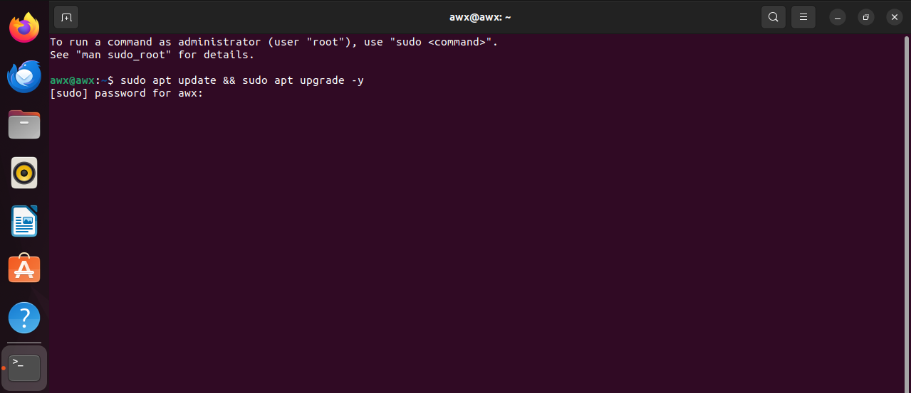 
</p>

After updating all the repositories, we must install the necessary packages.

```
sudo apt install curl git python3-pip pwgen -y
```
<p align="center" width="100%">
    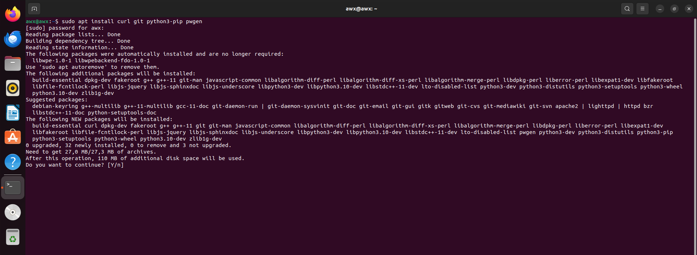 
</p>

#### STEP 2

After installing the necessary packages, we'll do a curl to install docker.

```
curl -sSL https://get.docker.com | sh
```
<p align="center" width="100%">
    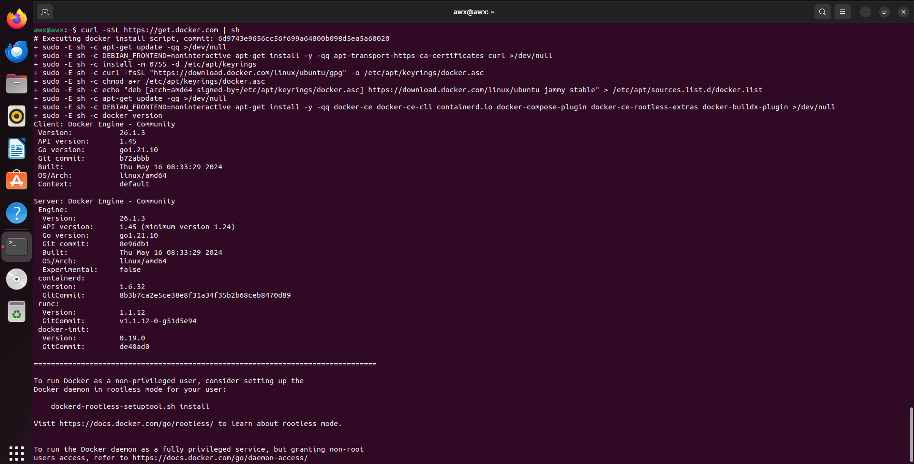 
</p>

Before continuing installing packages we must give permissons to the user.

```
sudo usermod -aG docker $(whoami) 
```
<p align="left" width="100%">
    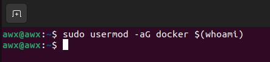 
</p>

In the previous step, we had given permission to docker to proceed with our project. Now, it is time to execute a command that will allow us to install the remaining components and complete the initial configuration.

```
sudo apt install docker-compose nodejs npm ansible -y
```
<p align="left" width="100%">
    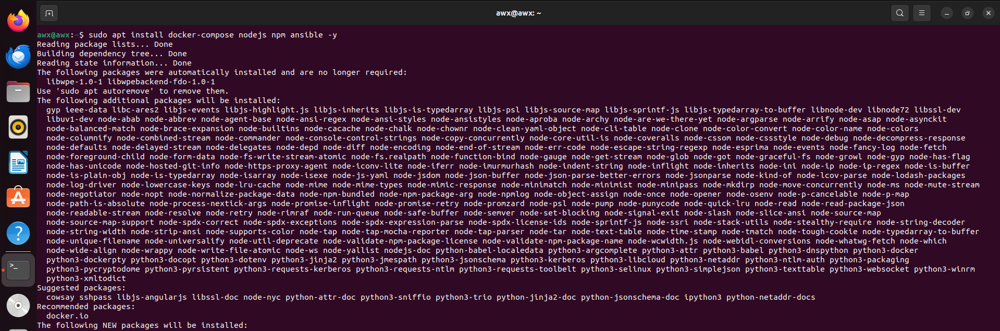 
</p>

Once we executed the last command, we must see which version is running on docker and if the service is running properly.

```
docker-compose version
```
<p align="left" width="100%">
    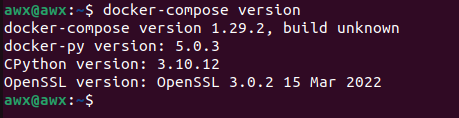 
</p>

```
sudo systemctl status docker.service
```

<p align="left" width="100%">
    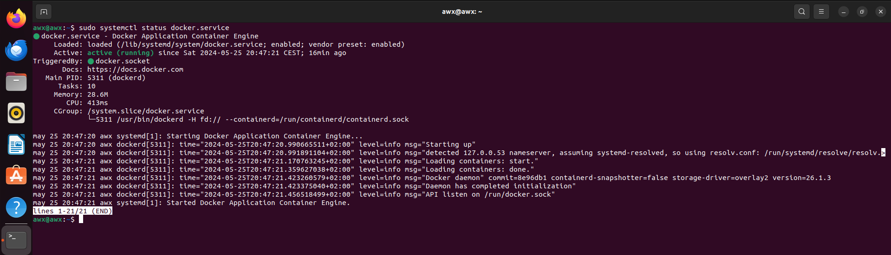 
</p>

```
sudo systemctl status docker.socket
```
<p align="left" width="100%">
     
</p>

Next, we must install the npm-global to make ansible works

```
sudo npm install npm –global
```


And finally we are going to clone the repository of ansible awx. (Is a slow process, keep calm)

```
git clone -b 17.1.0 https://github.com/ansible/awx.git
```
<p align="left" width="100%">
    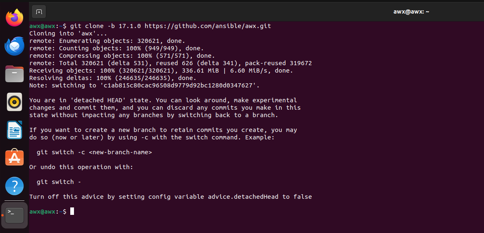 
</p>

We will move to "awx/installer" and we will install the pwgen to generate a key.

```
cd awx/installer
```

```
pwgen -N 1 -s 30
```

<p align="left" width="100%">
    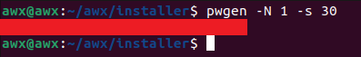 
</p>

With this key, we'll modify the secret_key of the inventory and we must modify the password to put one more secure and save the inventory. (In case that you want to change the user too, you can)

```
sudo nano inventory
```

<p align="left" width="100%">
    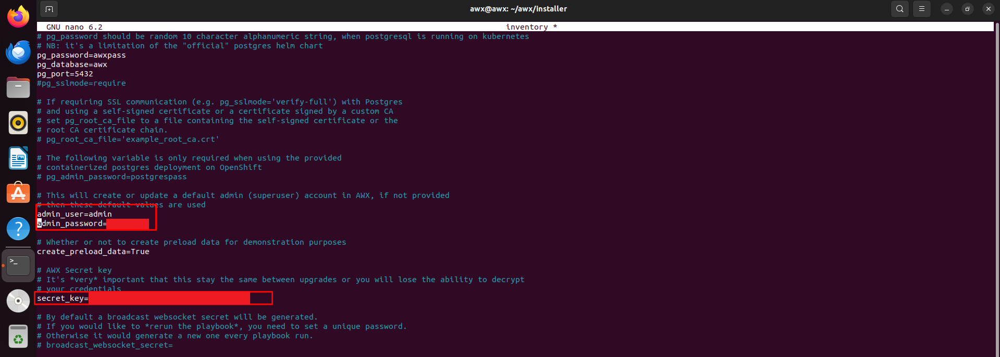 
</p>

And the last command will be the next one, that executes the install.yml to finally have configured ansible awx.

```
sudo ansible-playbook -i inventory install.yml
```

<p align="left" width="100%">
    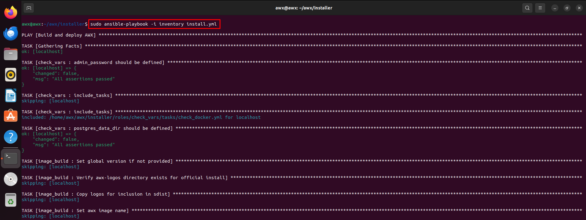 
</p>

Now, when the command finishes we must check our IP.

```
ip a s
```

<p align="left" width="100%">
    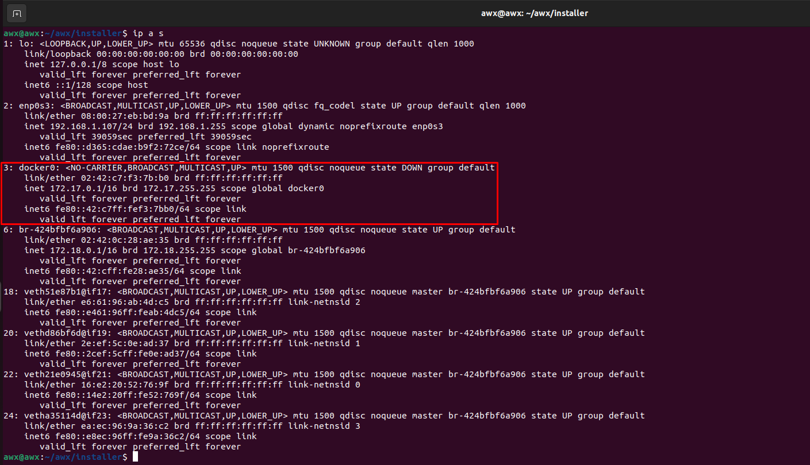 
</p>

And go to the browser to acces to AWX with the credentials that we decided in the inventory.

<p align="left" width="100%">
    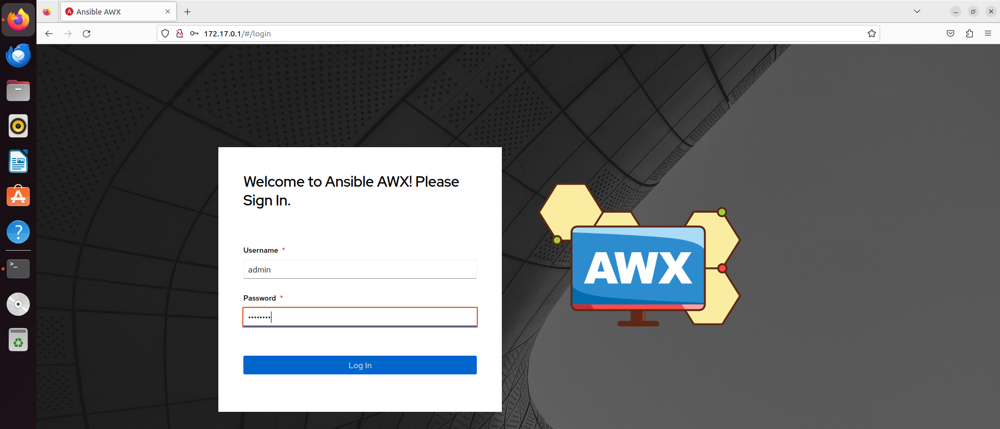 
</p>

That would be the guide to install Ansible AWX on Ubuntu 22.04 LTS.

<p align="left" width="100%">
    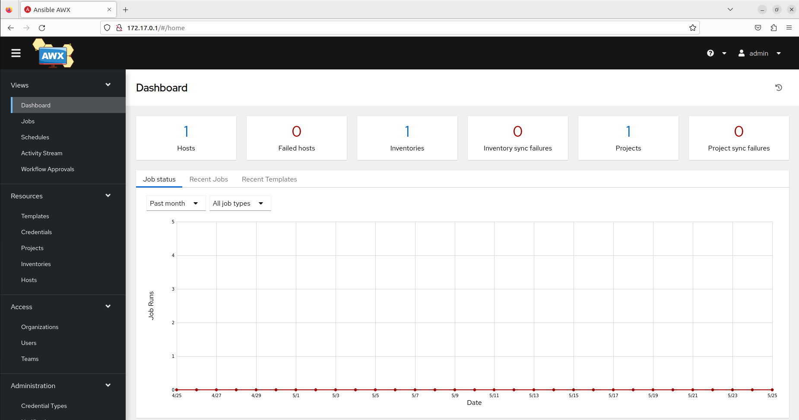 
</p>

**I hope you liked! :)**
